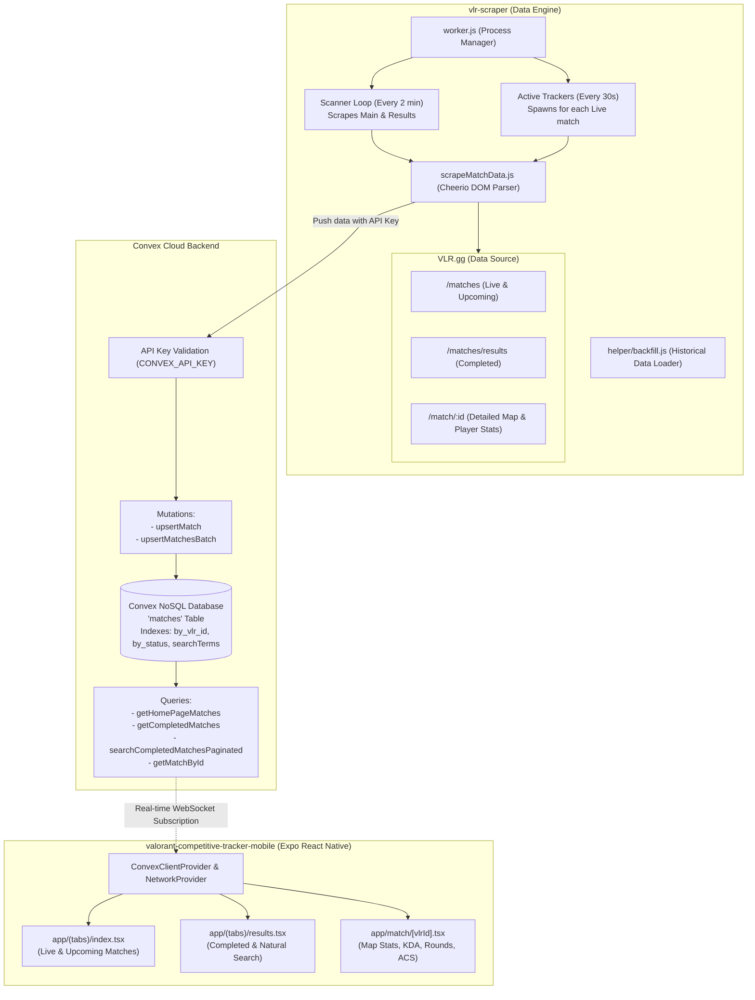

# Valorant Competitive Tracker (VCT Tracker) — Complete System Guide

An end-to-end guide explaining the architecture, data pipeline, source code structure, and step-by-step instructions on how to set up and run the entire VCT Tracker ecosystem.

---

## 1. System Overview & Architecture

The **VCT Tracker** system is composed of two independent but tightly coupled projects connected through a shared **Convex** cloud backend:

1. **`vlr-scraper` (Backend Data Ingestion Engine & Worker)**:
   - An automated NodeJS daemon that parses tournament, match, team, map, and player stats from [VLR.gg](https://www.vlr.gg).
   - Features a dual-rate scanning engine: a low-frequency scanner (2 minutes) for tournament lists/results, and an intelligent high-frequency tracker (30 seconds) for active live matches.
   - Syncs parsed data into the Convex database using authenticated batch mutations with intelligent in-memory diff caching to avoid duplicate writes.

2. **`valorant-competitive-tracker-mobile` (Mobile Frontend Client)**:
   - A React Native mobile app built with Expo SDK 54, React 19, Expo Router, and React Native Reanimated.
   - Subscribes in real time to the Convex backend to display live match scores, upcoming fixtures, paginated match results, player leaderboards (KDA, ACS, ADR, HS%, First Kills/Deaths), and round-by-round timelines.
   - Includes offline network awareness to pause subscriptions when disconnected.

3. **Convex Backend (Shared Serverless Database & Real-Time Sync)**:
   - Acts as the single source of truth. Both repositories contain matching `convex/` directories (`schema.js`, `matches.js`, `shared.js`).
   - Mutations are secured with an API key (`CONVEX_API_KEY`).
   - Provides reactive queries that push data updates to mobile clients via WebSockets without manual polling or page refreshing.

---

### Architecture & Data Flow Diagram



---

## 2. Deep-Dive: How Each Part Works

### 2.1 The Scraping Engine (`vlr-scraper`)

- **`worker.js`**:
  - **Scanner (Runs every 2 minutes)**: Fetches match URLs from `https://www.vlr.gg/matches` and `https://www.vlr.gg/matches/results/?page=1`. It parses their details, checks against an in-memory cache (`lastScrapedMatchesData`) using `lodash.isEqual`, and batch-upserts any new or modified matches via Convex mutation `matches:upsertMatchesBatch`.
  - **Live Match Tracker (Runs every 30 seconds)**: Whenever the Scanner detects a match with `status: 'live'`, it spawns a dedicated interval timer specifically for that match (`runTracker`). This scrapes the match's detailed page every 30 seconds for round updates and player stat changes. When the match finishes, the tracker automatically terminates.
- **`scrapeMatchData.js`**:
  - Uses `axios` and `cheerio` to parse VLR.gg DOM structures.
  - Extracts tournament information, series name, team names, logos, map picks/bans, per-map scores, round histories (winning team, win conditions like elimination, defuse, bomb exploded), and per-player statistics (ACS, Kills, Deaths, Assists, +/-, ADR, HS%, First Kills, First Deaths).
- **`helper/backfill.js`**:
  - Crawls historical match results page by page from VLR.gg and uploads them to Convex. Useful when setting up a new database to populate hundreds of past matches.
- **`notifications.js`**:
  - Sends webhook alerts (e.g., Discord/Slack) when scraper failures or critical events occur, with a built-in 30-minute cooldown timer.

---

### 2.2 The Backend & Database (`convex/`)

Both repositories share the same Convex schema and business logic:

- **`convex/schema.js`**:
  - Defines the `matches` collection.
  - **Indexes**:
    - `by_vlr_id`: Quick $O(1)$ lookups by match ID.
    - `by_status`: Fast retrieval of `live`, `upcoming`, and `completed` matches.
    - `by_status_time`: Ordered retrieval by date/time.
    - `searchIndex ("by_search_terms_and_status")`: Full-text search on `searchTerms` with status filtering.
- **`convex/shared.js`**:
  - Strict Convex runtime data validators for player stats (`playerStatsSchema`), rounds (`roundSchema`), maps (`mapSchema`), and matches (`matchSchema`).
- **`convex/matches.js`**:
  - **`upsertMatch` / `upsertMatchesBatch`**: Sanitizes match titles, generates fuzzy search terms (e.g., normalizes accents `KRÜ` -> `kru`, and creates welded tokens like `loudvssen`, `vctstage2`), verifies `CONVEX_API_KEY`, and inserts or patches records.
  - **`getHomePageMatches`**: Returns live matches and the next $N$ upcoming matches.
  - **`getCompletedMatches`**: Paginated query for match results.
  - **`searchCompletedMatchesPaginated`**: Performs full-text search across team names, event names, and matchups.
  - **`getMatchById`**: Returns the full detailed match record (all maps, player tables, and rounds).

---

### 2.3 The Mobile App (`valorant-competitive-tracker-mobile`)

- **Routing & Structure (`app/`)**:
  - `_layout.tsx`: Root provider wrapping the entire app with `SafeAreaProvider`, `NetworkProvider`, `ConvexClientProvider`, font loading (Inter), and Aptabase analytics.
  - `(tabs)/_layout.tsx`: Bottom tab bar navigation.
  - `(tabs)/index.tsx`: **Home Screen** displaying live match banners (pulsing live indicators) and upcoming match cards. Updates automatically whenever Convex changes.
  - `(tabs)/results.tsx`: **Results Screen** with infinite scrolling and search bar supporting queries like `"Sentinels"`, `"Fnatic vs Paper Rex"`, or `"Masters Madrid"`.
  - `match/[vlrId].tsx`: **Match Details Screen** displaying:
    - Overall team scores and map summary.
    - Map selector tabs (Map 1, Map 2, All Maps).
    - Team comparison bar charts.
    - Player leaderboard with switchable sorting (Rating, ACS, K/D/A, HS%, ADR).
    - Interactive round history timeline with attack/defense indicators and win conditions.
- **Optimizations & Resiliency (`providers/` & `hooks/`)**:
  - `useNetworkAwareQuery.ts`: Custom hook that intercepts Convex queries. When device is offline, it freezes subscriptions to avoid network errors and battery drain.
  - `NetworkBanner.tsx`: Shows an offline indicator banner when connection is lost.

---

## 3. Step-by-Step Setup and Execution Guide

Follow these steps in order to get the backend, scraper, and mobile app running.

```
┌────────────────────────────────────────────────────────┐
│ STEP 1: Set up Convex Backend                          │
│         Create project -> Deploy schema -> Set API key │
└──────────────────────────┬─────────────────────────────┘
                           │
        ┌──────────────────┴──────────────────┐
        ▼                                     ▼
┌───────────────────────────────┐   ┌────────────────────────────────┐
│ STEP 2: Start Data Scraper    │   │ STEP 3: Run Mobile App         │
│         Configure .env.local  │   │         Configure .env         │
│         Run worker.js         │   │         Run npx expo start     │
└───────────────────────────────┘   └────────────────────────────────┘
```

---

### Step 1: Set Up Convex Backend

Convex serves as the real-time cloud backend for both projects.

1. **Sign up / Log in to Convex**:
   - Go to [convex.dev](https://www.convex.dev/) and sign up with GitHub or Google (free tier is more than enough).

2. **Initialize Convex in the Project**:
   Open a terminal in the mobile project folder:
   ```bash
   cd "d:/Random project/VCT Tracker/valorant-competitive-tracker-mobile"
   npm install
   npx convex dev
   ```
   - Follow the interactive prompts in the terminal to log in and create a new project (e.g., `vct-tracker`).
   - Convex will generate a deployment URL (e.g. `https://happy-otter-123.convex.cloud`) and a `.env.local` file.
   - Once the schema is uploaded and initialized, you can press `Ctrl + C` or leave it running.

3. **Set the Scraper API Key in Convex Dashboard**:
   - Open your Convex Dashboard at [dashboard.convex.dev](https://dashboard.convex.dev).
   - Select your project -> Go to **Settings** -> **Environment Variables**.
   - Add a new variable:
     - **Name**: `CONVEX_API_KEY`
     - **Value**: Create any secure random string (e.g., `my_secret_vct_api_key_2026`).
   - Click **Save**.

4. **Copy your Convex Deployment URL**:
   - Find your **Deployment URL** under **Settings** -> **URL & Deploy Key** (looks like `https://<your-project-name>.convex.cloud`).

---

### Step 2: Configure & Run the Scraper (`vlr-scraper`)

1. **Navigate to the scraper directory & install dependencies**:
   ```bash
   cd "d:/Random project/VCT Tracker/vlr-scraper"
   npm install
   ```

2. **Create the Environment File (`.env.local`)**:
   In `vlr-scraper/.env.local`, add the following:
   ```env
   CONVEX_URL=https://<your-project-name>.convex.cloud
   CONVEX_API_KEY=my_secret_vct_api_key_2026
   WEBHOOK_URL=
   ```
   *(Replace with your actual Convex URL and the `CONVEX_API_KEY` you set in Step 1).*

3. **Test the Scraper & Convex Connection**:
   ```bash
   # Test scraping a match from VLR.gg
   npm run test-scraper

   # Test sending data to your Convex deployment
   npm run test-convex
   ```

4. **(Optional) Backfill Historical Matches**:
   If you want to load past matches into your app immediately:
   - Make sure `.env.production.local` or `.env.local` has your `CONVEX_URL` and `CONVEX_API_KEY`.
   - Run:
     ```bash
     node helper/backfill.js
     ```

5. **Start the Continuous Scraper Worker**:
   ```bash
   node worker.js
   ```
   *The worker will now run continuously in the background, scanning for matches every 2 minutes and tracking live matches every 30 seconds.*

---

### Step 3: Configure & Run the Mobile App (`valorant-competitive-tracker-mobile`)

1. **Navigate to the mobile app directory**:
   ```bash
   cd "d:/Random project/VCT Tracker/valorant-competitive-tracker-mobile"
   ```

2. **Create the Environment File (`.env`)**:
   In `valorant-competitive-tracker-mobile/.env`, add:
   ```env
   EXPO_PUBLIC_CONVEX_URL=https://<your-project-name>.convex.cloud
   EXPO_PUBLIC_APTABASE_API_KEY=
   ```
   *(Note: The prefix `EXPO_PUBLIC_` makes the variable accessible inside the React Native bundle).*

3. **Ensure Convex Types are Generated**:
   ```bash
   npx convex codegen
   ```

4. **Start the Expo Development Server**:
   ```bash
   npx expo start
   ```

5. **Run the App on a Device / Emulator**:
   - **Physical Device (Fastest)**: Install the **Expo Go** app from App Store / Google Play. Scan the QR code displayed in the terminal with your phone camera or Expo Go app.
   - **Android Emulator**: Press `a` in the terminal (requires Android Studio & Android Virtual Device).
   - **iOS Simulator (macOS only)**: Press `i` in the terminal.
   - **Web Browser**: Press `w` to run on localhost web view.

---

## 4. File Structure & Reference

### Project Tree

```
VCT Tracker/
├── VCT_TRACKER_COMPLETE_GUIDE.md          # This documentation guide
├── vlr-scraper/                           # Backend Data Ingestion Engine
│   ├── .env.local                         # Scraper environment variables
│   ├── Dockerfile                         # Container setup for production deployment
│   ├── package.json                       # Scraper dependencies (axios, cheerio, convex)
│   ├── worker.js                          # Main worker loop (Scanner + Tracker)
│   ├── scrapeMatchData.js                 # Cheerio HTML scraper for VLR.gg
│   ├── notifications.js                   # Webhook notification handler
│   ├── convex/                            # Convex backend functions & schemas
│   │   ├── schema.js                      # Table definitions & search indexes
│   │   ├── shared.js                      # Data validators (match, player, round, map)
│   │   └── matches.js                     # Mutations (upsert) & Queries
│   ├── helper/
│   │   └── backfill.js                    # Batch scraper for historical matches
│   └── tests/
│       ├── testConvex.js                  # Connectivity test for Convex
│       └── testScrapeMatchData.js         # Unit test for parsing VLR match HTML
│
└── valorant-competitive-tracker-mobile/   # Mobile App Frontend (Expo / React Native)
    ├── .env                               # Mobile environment variables
    ├── app.json                           # Expo application configuration
    ├── package.json                       # React Native & Expo dependencies
    ├── convex/                            # Matching Convex backend files
    │   ├── schema.js
    │   ├── shared.js
    │   └── matches.js
    ├── app/                               # Expo Router Pages & Navigation
    │   ├── _layout.tsx                    # Root Layout, font loader & provider wrapper
    │   ├── (tabs)/
    │   │   ├── _layout.tsx                # Bottom Tab Bar configuration
    │   │   ├── index.tsx                  # Home Screen (Live & Upcoming Matches)
    │   │   └── results.tsx                # Results Screen (Completed & Search)
    │   └── match/
    │       └── [vlrId].tsx                # Detailed Match View (Stats, Maps, Rounds)
    ├── components/                        # Reusable UI Components
    │   ├── MatchCard.tsx                  # Card for live, upcoming & completed matches
    │   ├── LoadingStates.tsx              # Skeleton loaders & spinners
    │   └── NetworkBanner.tsx              # Offline network banner
    ├── hooks/                             # Custom React Hooks
    │   └── useNetworkAwareQuery.ts        # Offline-safe Convex query subscriber
    ├── providers/                         # App Context Providers
    │   ├── ConvexClientProvider.tsx       # Convex React Provider
    │   └── NetworkProvider.tsx            # NetInfo connectivity context
    └── theme/                             # Styling & Design Tokens
        └── colors.ts                      # Dark theme color palette
```

---

## 5. Troubleshooting & FAQ

| Problem | Cause | Solution |
| :--- | :--- | :--- |
| `API key not configured on the Convex server` | `CONVEX_API_KEY` is missing in Convex dashboard. | Open [dashboard.convex.dev](https://dashboard.convex.dev), go to **Settings** -> **Environment Variables**, and add `CONVEX_API_KEY`. |
| `Invalid API key` | The key in `.env.local` does not match the key in Convex dashboard. | Ensure `CONVEX_API_KEY` in `vlr-scraper/.env.local` exactly matches the value in Convex Settings. |
| Scraper reports `403 Forbidden` or `Cloudflare block` | VLR.gg rate limiting or bot protection. | Increase `DELAY_BETWEEN_PAGES_MS` and `DELAY_BETWEEN_MATCHES_MS` in `helper/backfill.js` or `worker.js`. |
| Mobile app shows blank screen or loading spinner indefinitely | `EXPO_PUBLIC_CONVEX_URL` is missing or incorrect in `.env`. | Verify that `valorant-competitive-tracker-mobile/.env` contains `EXPO_PUBLIC_CONVEX_URL=https://<your-project>.convex.cloud` and restart Expo with `npx expo start -c`. |
| `npx convex codegen` errors | Missing `_generated/` folder or npm dependencies. | Run `npm install` inside `valorant-competitive-tracker-mobile` to let Convex generate types. |

---

## 6. Summary Checklist

- [ ] Convex account created and `npx convex dev` executed.
- [ ] `CONVEX_API_KEY` environment variable added to Convex dashboard.
- [ ] `vlr-scraper/.env.local` created with `CONVEX_URL` and `CONVEX_API_KEY`.
- [ ] `vlr-scraper` worker tested with `npm run test-scraper` and `node worker.js`.
- [ ] `valorant-competitive-tracker-mobile/.env` created with `EXPO_PUBLIC_CONVEX_URL`.
- [ ] Mobile app started with `npx expo start` and tested on Expo Go / Emulator.

## Credits

All credit for the original creation of this project goes to the original creator (please insert their name here). Thank you for your hard work!
